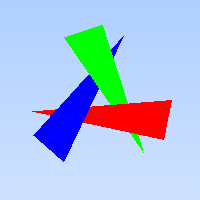

# Week 4 — Shapes + Ray–Shape Intersection

This week, we worked to conceptualize the idea of the ray and how it's used to intersect shapes in the scene.

---

## You are done if…

By the end of Week 4, you should be able to:

- Define an abstract `Shape` interface
- Implement a hit record structure (`HitStruct`)
- Implement ray–sphere intersection
- Implement ray–triangle intersection (recommended)
- Build a small scene containing spheres and/or triangles
- Render an image that visually shows the objects
- Export the rendered image to PNG

---

## Files added / modified in Week 4

Core files introduced this week:

```
HitStruct.h
Shape.h
Sphere.h
Sphere.cpp
Triangle.h
Triangle.cpp
fbMain.cpp   (updated to render scene)
```

---

## What your output should look like

When you run your Week 4 program, you should produce an image where:

- Objects (sphere and/or triangles) are visible
- Background is different from object color
- Pixels change based on **ray–object hits**

Given the scenes on Canvas (and on fbMain.cpp below), you should be able to generate some images like below




---

## Core idea of Week 4

### Rays can hit geometry

Previously:

- every ray just produced a background color

Now:

- each ray tests against scene objects
- if it hits → shade the object  
- if it misses → show background

This is the fundamental loop of ray tracing.

---


### Hit record (HitStruct) {You can also add this in the next week where we introduce shading}

The hit structure typically stores:

- intersection parameter `t`
- hit point
- Shape info
- surface normal (later)

This allows the renderer to:

- determine the closest hit
- compute shading
- extend later to lighting and reflections

---

## High-level render flow (Week 4)

Your main loop now conceptually does:

1. For each pixel  
2. Generate a ray from the camera  
3. Test the ray against all shapes  
4. If hit -> compute object color  
5. Else -> background color  
6. Store result in framebuffer  
7. Export PNG

---

## CMake reminder (VERY common issue)

If your program builds but intersections “don’t work,” check:

- Did you add **Sphere.cpp** to your library target?
- Did you add **Triangle.cpp** to your library target?
- Did you re-run CMake after editing CMakeLists?

If a `.cpp` file is missing from the target, the code will compile but your implementation may never be linked.

---

## How your code might look like

The following are example snippets matching this week’s structure. Your design may vary — that’s okay — as long as your code meets the Week 4 checklist.

### HitStruct.h (to be updated later)

```cpp
#include "vec3.h"

class Shape;

struct HitStruct
{
    float t;
    vec3 point;
    const Shape* shape = nullptr;
};
```

---

### Shape.h

```cpp
#pragma once

#include "HitStruct.h"
#include "ray.h"
#include "vec3.h"

class Shape
{
public:
    virtual bool intersect(const ray& r, float t_min, float& t_max, HitStruct& hit) const = 0;
    virtual vec3 getColor() const = 0;
};
```

---

### Sphere.h

```cpp
#pragma once

#include "vec3.h"
#include "Shape.h"


class Sphere : public Shape
{
public:
    Sphere(): center(vec3(0, 0, 0)), radius(1.0), color(vec3(1.0, 1.0, 1.0)) {}
    Sphere(vec3 c, float r): center(c), radius(r), color(vec3(1.0, 1.0, 1.0)) {}
    Sphere(vec3 c, float r, vec3 col): center(c), radius(r), color(col) {}

    bool intersect(const ray& r, float t_min, float& t_max, HitStruct& hit) const override;
    vec3 getColor() const override;
private:
    vec3 center;
    float radius;
    vec3 color;
};
```

### Sphere.cpp

```cpp
#include "Sphere.h"

bool Sphere::intersect(const ray& r, float t_min, float& t_max, HitStruct& hit) const
{
    vec3 oc = r.origin() - center;

    float a = dot(r.direction(), r.direction());
    float b = 2.0f * dot(oc, r.direction());
    float c = dot(oc, oc) - radius*radius;

    float discriminant = b*b - 4*a*c;

    if (discriminant < 0) {
        return false;
    }

    float sqrt_disc = std::sqrt(discriminant);

    float t1 = (-b - sqrt_disc) / (2.0f * a);
    float t2 = (-b + sqrt_disc) / (2.0f * a);

    if (t1 > t_min && t1 < t_max) {
        t_max = t1;
        hit.t = t1;
        hit.point = r.at(t1);
        hit.shape = this;
        return true;
    }

    if (t2 > t_min && t2 < t_max) {
        t_max = t2;
        hit.t = t2;
        hit.point = r.at(t2);
        hit.shape = this;
        return true;
    }

    return false;
}

vec3 Sphere::getColor() const
{
    return color;
}
```

### Triangle.h
```cpp
#pragma once

#include "vec3.h"
#include "Shape.h"

class Triangle : public Shape
{
public:
    Triangle() : vertex_a(vec3(0, 0, 0)), vertex_b(vec3(1, 0, 0)), vertex_c(vec3(0, 1, 0)), color(vec3(1.0, 1.0, 1.0)) {}
    Triangle(const vec3& a, const vec3& b, const vec3& c) : vertex_a(a), vertex_b(b), vertex_c(c), color(vec3(1.0, 1.0, 1.0)) {}
    Triangle(const vec3& a, const vec3& b, const vec3& c, const vec3& col) : vertex_a(a), vertex_b(b), vertex_c(c), color(col) {}

    bool intersect(const ray& r, float t_min, float& t_max, HitStruct& hit) const override;
    vec3 getColor() const override;
private:
    vec3 vertex_a, vertex_b, vertex_c;
    vec3 color;
};
```

### Triangle.cpp

```cpp
#include "Triangle.h"

bool Triangle::intersect(const ray &r, float t_min, float &t_max, HitStruct &hit) const
{
  double a = vertex_a[0] - vertex_b[0];
  double b = vertex_a[1] - vertex_b[1];
  double c = vertex_a[2] - vertex_b[2];

  double d = vertex_a[0] - vertex_c[0];
  double e = vertex_a[1] - vertex_c[1];
  double f = vertex_a[2] - vertex_c[2];

  double g = r.direction()[0];
  double h = r.direction()[1];
  double i = r.direction()[2];

  double j = vertex_a[0] - r.origin()[0];
  double k = vertex_a[1] - r.origin()[1];
  double l = vertex_a[2] - r.origin()[2];

  double ei_hf = e * i - h * f;
  double gf_id = g * f - d * i;
  double dh_eg = d * h - e * g;

  double M = a * ei_hf + b * gf_id + c * dh_eg;

  double t = -1.0, gamma = -1.0, beta = -1.0;

  double ak_jb = a * k - j * b;
  double jc_al = j * c - a * l;
  double bl_kc = b * l - k * c;

  t = -(f * ak_jb + e * jc_al + d * bl_kc) / M;
  if (t < t_min || t > t_max) {
    return false;
  }

  gamma = (i * ak_jb + h * jc_al + g * bl_kc) / M;
  if (gamma < 0.0 || gamma > 1.0) {
    return false;
  }

  beta = (j * ei_hf + k * gf_id + l * dh_eg) / M;
  if (beta < 0.0 || beta > 1.0 - gamma) {
    return false;
  }

  t_max = t;
  hit.t = t;
  hit.point = r.at(t);
  hit.shape = this;

  return true;
}

vec3 Triangle::getColor() const
{
  return color;
}
```

---

### fbMain.cpp (updated)

```cpp
#include <iostream>
#include <vector>
#include <memory>
#include <limits>
#include "Framebuffer.h"
#include "PerspectiveCamera.h"
#include "ray.h"
#include "Shape.h"
#include "Sphere.h"
#include "Triangle.h"

vec3 computeRayColor(const ray &r, const std::vector<std::shared_ptr<Shape>> &shapes)
{
  float t_min = 0.001f;
  float t_max = std::numeric_limits<float>::max();

  HitStruct closestHit;
  closestHit.t = t_max;
  bool hitAnything = false;

  // Check intersection with all shapes, find closest
  for (const auto &shape : shapes) {
    HitStruct tempHit;
    if (shape->intersect(r, t_min, t_max, tempHit)) {
      if (tempHit.t < closestHit.t) {
        closestHit = tempHit;
        hitAnything = true;
        t_max = tempHit.t;
      }
    }
  }

  if (hitAnything) {
    return closestHit.shape->getColor();
  }

  // Background color
  vec3 unit_direction = unit_vector(r.direction());
  auto a = 0.5 * (unit_direction.y() + 1.0);
  return (1.0 - a) * vec3(1.0, 1.0, 1.0) + a * vec3(0.5, 0.7, 1.0);
}

int main(int argc, char *argv[])
{
  Framebuffer fb(200, 200);

  // Default Camera: focal length = 1.0, image plane width = 0.5
  PerspectiveCamera cam(vec3(0, 0, 0), vec3(0, 0, -1), 1.0, 0.5, 0.5, 200, 200);

  // Create scene with three triangles
  std::vector<std::shared_ptr<Shape>> shapes;

  // Red Triangle 1
  shapes.push_back(std::make_shared<Triangle>(
    vec3(-1.2, -0.2, -7), vec3(0.8, -0.5, -5), vec3(0.9, 0, -5),
    vec3(1.0, 0.0, 0.0)));

  // Green Triangle 2
  shapes.push_back(std::make_shared<Triangle>(
    vec3(0.773205, -0.93923, -7), vec3(0.0330127, 0.94282, -5), vec3(-0.45, 0.779423, -5),
    vec3(0.0, 1.0, 0.0)));

  // Blue Triangle 3
  shapes.push_back(std::make_shared<Triangle>(
    vec3(0.426795, 1.13923, -7), vec3(-0.833013, -0.44282, -5), vec3(-0.45, -0.779423, -5),
    vec3(0.0, 0.0, 1.0)));

  // SPHERE RENDERING (COMMENTED OUT)
  // Default Camera: focal length = 0.7, image plane width = 0.5
  // PerspectiveCamera cam(vec3(0, 0, 0), vec3(0, 0, -1), 0.7, 0.5, 0.5, 200, 200);
  //
  // Yellow Sphere 1: center (0, -1.25, -7), radius 0.3
  // shapes.push_back(std::make_shared<Sphere>(vec3(0, -1.25, -7), 0.3f, vec3(0.992, 0.863, 0.239)));
  //
  // Blue Sphere 2: center (0, 0, -10), radius 3
  // shapes.push_back(std::make_shared<Sphere>(vec3(0, 0, -10), 3.0f, vec3(0.149, 0.451, 0.698)));
  //
  // Yellow Sphere 3: center (0, 0, -15), radius 5
  // shapes.push_back(std::make_shared<Sphere>(vec3(0, 0, -15), 5.0f, vec3(0.992, 0.863, 0.239)));


  for (int x = 0; x < 200; x++) {
    for (int y = 0; y < 200; y++) {
      ray r = cam.generateRay(x, y);
      vec3 pixelColor = computeRayColor(r, shapes);
      fb.setPixelColor(x, y, pixelColor);
    }
  }

  fb.exportToPNG("triangles.png");

  return 0;
}
```

---

## Self-check: Debug checklist

### “I still only see the gradient”

Most likely:

- your intersection test always returns false
- you never call the shape intersection in your render loop
- your `t_min` / `t_max` range is wrong

---

### “Sphere is invisible”

Common causes:

- sphere is behind the camera
- radius is too small
- ray direction is wrong
- wrong quadratic discriminant logic

---


[Week3](week3.md) | [Home](index.md)
