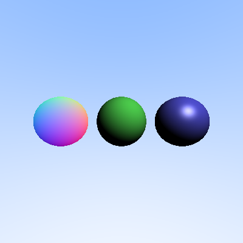

# Week 5 — Shaders and Lighting Models

This week builds on your ray–shape intersection system by introducing **surface shading**.

---

## You are done if…

By the end of Week 5, you should be able to:

- Define a base `Shader` interface
- Implement multiple shader models:
  - Normal shader (You can skip a separate class for this and calculate manually if no shader is given)
  - Lambertian shader
  - Blinn–Phong shader
- Attach shaders to shapes
- Use surface normals and lights to compute final color
- Render a scene where different shaders produce visibly different results
- Export the shaded image to PNG

---

## Files added / modified in Week 5

Shader system:

```
Shader.h
NormalShader.h / .cpp
LambertianShader.h / .cpp
BlinnPhongShader.h / .cpp
PointLight.h
HitStruct.h (modified)
Shape files (shaders added)
```

Shape updates:

- Shapes now store or reference a shader
- Intersection logic feeds data into the shader

Driver update:

```
fbMain.cpp   (updated to use shaders)
```

---

## What your output should look like

When you run your Week 5 program, you should produce an image where:

- Objects are clearly visible
- Surface appearance depends on the shader
- Lambertian surfaces show diffuse shading
- Blinn–Phong surfaces show specular highlights
- Normal shader visualizes surface normals

If your scene still looks flat or identical to Week 4, your shader is likely not being used correctly.

If you use the scene attached in `fbMain.cpp` below, you should have an image like this - 



---

## Core idea of Week 5

### From hit detection to material shading

Previously (Week 4):

- ray hit -> constant/debug color

Now (Week 5):

- ray hit -> call shader -> compute physically meaningful color

---

### Shader abstraction

Your shader hierarchy enables polymorphic shading:

- `Shader` (base class)
- `NormalShader`
- `LambertianShader`
- `BlinnPhongShader`

---

### Role of the light

With Lambertian and Blinn–Phong shading, lighting now depends on:

- surface normal
- light direction
- view direction (for specular)
- material parameters

Correct normalization is extremely important.

---

## CMake reminder (very common issue)

If shading compiles but behaves incorrectly, check:

- Did you add all new shader `.cpp` files to your library target?
- Did you re-run CMake after modifying targets?
- Are the headers included in the correct places?

Missing a shader `.cpp` in CMake is one of the most common silent failures.

---

## How your code might look like

The following are example snippets matching this week’s structure. Your design may vary — that’s okay — as long as your code meets the Week 5 checklist.

### HitStruct.h

```cpp
#pragma once
#include "vec3.h"

class Shape;

struct HitStruct
{
    float t;
    vec3 point;
    vec3 normal;
    const Shape* shape = nullptr;
};
```

---

### Shader.h

```cpp
#pragma once

#include "HitStruct.h"
#include "PointLight.h"
#include "vec3.h"
#include <vector>
#include <memory>

class Shader
{
public:
  virtual vec3 rayColor(const HitStruct &hit, const std::vector<std::shared_ptr<PointLight>> &lights) = 0;
};
```

### NormalShader.h

```cpp
#pragma once

#include "Shader.h"
#include "HitStruct.h"
#include "vec3.h"

class NormalShader : public Shader
{
public:
    vec3 rayColor(const HitStruct& hit, const std::vector<std::shared_ptr<PointLight>>& lights) override;
};
```

### NormalShader.cpp

```cpp
#include "NormalShader.h"

vec3 NormalShader::rayColor(const HitStruct& hit, const std::vector<std::shared_ptr<PointLight>>& lights)
{
    vec3 normalizedNormal = (hit.normal + vec3(1.0, 1.0, 1.0)) * 0.5;
    return normalizedNormal;
}
```

### LambertianShader.h

```cpp
#pragma once
#include "Shader.h"

class LambertianShader : public Shader {
public:
    vec3 rayColor(const HitStruct& hit, const std::vector<std::shared_ptr<PointLight>>& lights) override;
};
```

### LambertianShader.cpp
```cpp
#include "LambertianShader.h"
#include "Shape.h"

vec3 LambertianShader::rayColor(const HitStruct& hit, const std::vector<std::shared_ptr<PointLight>>& lights)
{
    vec3 materialColor = hit.shape->getColor();
    vec3 color(0.0, 0.0, 0.0);
    
    for (const auto& light : lights) {
        vec3 lightDir = unit_vector(light->getPosition() - hit.point);
        float diff = std::max(dot(hit.normal, lightDir), 0.0);
        color += diff * light->getColor() * light->getIntensity();
    }
    
    vec3 result = materialColor * color;
    
    // Clamp to [0, 1]
    result = vec3(
        std::min(result.x(), 1.0),
        std::min(result.y(), 1.0),
        std::min(result.z(), 1.0)
    );
    
    return result;
}
```

### BlinnPhongShader.h

```cpp
#pragma once
#include "Shader.h"

class BlinnPhongShader : public Shader
{
public:
    vec3 rayColor(const HitStruct& hit, const std::vector<std::shared_ptr<PointLight>>& lights) override;
    void setEyePosition(const vec3& pos) { eyePos = pos; }

private:
    vec3 eyePos = vec3(0, 0, 0);
};
```

### BlinnPhongShader.cpp

```cpp
#include "BlinnPhongShader.h"
#include "Shape.h"

vec3 BlinnPhongShader::rayColor(const HitStruct& hit, const std::vector<std::shared_ptr<PointLight>>& lights)
{
    vec3 materialColor = hit.shape->getColor();
    vec3 color(0.0, 0.0, 0.0);
    
    // Coefficients for diffuse, specular, and shininess
    // better to make these parameters of the shader class for flexibility, but hardcoding for now
    float kd = 1.0f;
    float ks = 0.6f;
    float p = 32.0f;
    
    // View direction: from hit point toward the eye position
    vec3 V = unit_vector(eyePos - hit.point);
    
    for (const auto& light : lights) {
        // Light direction: from hit point toward the light
        vec3 L = unit_vector(light->getPosition() - hit.point);
        
        // Half-vector: bisector between light and view directions
        vec3 H = unit_vector(L + V);
        
        // Diffuse term: L = kd * I * max(0, n·l)
        float diff = std::max(dot(hit.normal, L), 0.0);
        vec3 diffuse = kd * diff * light->getColor() * light->getIntensity();
        
        // Specular term: L = ks * I * max(0, n·h)^p
        float spec = std::pow(std::max(dot(hit.normal, H), 0.0), p);
        vec3 specular = ks * spec * light->getColor() * light->getIntensity();
        
        color += diffuse * materialColor + specular;
    }
    
    // Clamp to [0,1]
    color = vec3(
        std::min(color.x(), 1.0),
        std::min(color.y(), 1.0),
        std::min(color.z(), 1.0)
    );

    return color;
}
```

---

### PointLight.h

```cpp
#pragma once
#include "vec3.h"

class PointLight
{
public:
    PointLight(const vec3& pos, const vec3& col, float intens = 1.0f)
        : position(pos), color(col), intensity(intens) {}

    vec3 getPosition() const { return position; }
    vec3 getColor() const { return color; }
    float getIntensity() const { return intensity; }

private:
    vec3 position;
    vec3 color;
    float intensity = 1.0f;
};
```

---

### Shape.h (updated)

```cpp
#pragma once

#include "HitStruct.h"
#include "ray.h"
#include "vec3.h"
#include <memory>

class Shader;

class Shape
{
public:
    // ... (previous code)
    virtual std::shared_ptr<Shader> getShader() const = 0;
};
```

### Sphere.h (you can also use a setter instead of modifying the constructor)

```cpp
#pragma once

#include "vec3.h"
#include "Shape.h"
#include <memory>

class Shader;

class Sphere : public Shape
{
public:
    Sphere(): center(vec3(0, 0, 0)), radius(1.0), color(vec3(1.0, 1.0, 1.0)), shader(nullptr) {}
    Sphere(vec3 c, float r): center(c), radius(r), color(vec3(1.0, 1.0, 1.0)), shader(nullptr) {}
    Sphere(vec3 c, float r, vec3 col): center(c), radius(r), color(col), shader(nullptr) {}
    Sphere(vec3 c, float r, vec3 col, std::shared_ptr<Shader> shd): center(c), radius(r), color(col), shader(shd) {}

    bool intersect(const ray& r, float t_min, float& t_max, HitStruct& hit) const override;
    vec3 getColor() const override;
    std::shared_ptr<Shader> getShader() const override;
private:
    vec3 center;
    float radius;
    vec3 color;
    std::shared_ptr<Shader> shader;
};
```

### Sphere.cpp

```cpp
#include "Sphere.h"

bool Sphere::intersect(const ray& r, float t_min, float& t_max, HitStruct& hit) const
{
    // ... 

    if (t1 > t_min && t1 < t_max) {
        // ...
        hit.normal = unit_vector(hit.point - center);
        return true;
    }

    if (t2 > t_min && t2 < t_max) {
        // ...
        hit.normal = unit_vector(hit.point - center);
        return true;
    }

    return false;
}

// ...

std::shared_ptr<Shader> Sphere::getShader() const
{
    return shader;
}
```

### Same for Triangle.h and Triangle.cpp

### fbMain.cpp

```cpp
#include <iostream>
#include <vector>
#include <memory>
#include <limits>
#include "Framebuffer.h"
#include "PerspectiveCamera.h"
#include "ray.h"
#include "Shape.h"
#include "Sphere.h"
#include "NormalShader.h"
#include "LambertianShader.h"
#include "BlinnPhongShader.h"
#include "PointLight.h"

vec3 computeRayColor(const ray &r, const std::vector<std::shared_ptr<Shape>> &shapes, const std::vector<std::shared_ptr<PointLight>> &lights)
{
  float t_min = 0.001f;
  float t_max = std::numeric_limits<float>::max();

  HitStruct closestHit;
  closestHit.t = t_max;
  bool hitAnything = false;

  // Check intersection with all shapes, find closest
  for (const auto &shape : shapes) {
    HitStruct tempHit;
    if (shape->intersect(r, t_min, t_max, tempHit)) {
      if (tempHit.t < closestHit.t) {
        closestHit = tempHit;
        hitAnything = true;
        t_max = tempHit.t;
      }
    }
  }

  if (hitAnything) {
    auto shader = closestHit.shape->getShader();
    if (shader) {
      return shader->rayColor(closestHit, lights);
    } else {
      NormalShader defaultShader;
      return defaultShader.rayColor(closestHit, lights);
    }
  }

  // Background color
  vec3 unit_direction = unit_vector(r.direction());
  auto a = 0.5 * (unit_direction.y() + 1.0);
  return (1.0 - a) * vec3(1.0, 1.0, 1.0) + a * vec3(0.5, 0.7, 1.0);
}

int main(int argc, char *argv[])
{
  Framebuffer fb(400, 400);

  // Camera setup
  PerspectiveCamera cam(vec3(0, 0, 0), vec3(0, 0, -1), 1.0, 2.0, 2.0, 400, 400);

  // Create scene with three spheres
  std::vector<std::shared_ptr<Shape>> shapes;

  // Create shaders
  auto lambertianShader = std::make_shared<LambertianShader>();
  auto blinnPhongShader = std::make_shared<BlinnPhongShader>();
  blinnPhongShader->setEyePosition(cam.getPosition());

  // Create lights, for now one point light only
  std::vector<std::shared_ptr<PointLight>> lights;
  lights.push_back(std::make_shared<PointLight>(vec3(2, 3, 1), vec3(1.0, 1.0, 1.0)));

  // Sphere 1: Normal Shader (left)
  shapes.push_back(std::make_shared<Sphere>(
    vec3(-1.2, 0, -2.5), 0.5f, vec3(0.8, 0.3, 0.3)));

  // Sphere 2: Lambertian Shader (center)
  shapes.push_back(std::make_shared<Sphere>(
    vec3(0, 0, -2.5), 0.5f, vec3(0.3, 0.8, 0.3), lambertianShader));

  // Sphere 3: Blinn-Phong Shader (right)
  shapes.push_back(std::make_shared<Sphere>(
    vec3(1.2, 0, -2.5), 0.5f, vec3(0.3, 0.3, 0.8), blinnPhongShader));

  for (int x = 0; x < 400; x++) {
    for (int y = 0; y < 400; y++) {
      ray r = cam.generateRay(x, y);
      vec3 pixelColor = computeRayColor(r, shapes, lights);
      fb.setPixelColor(x, y, pixelColor);
    }
  }

  fb.exportToPNG("three_shaders.png");

  return 0;
}
```

---

## Self-check: Debug checklist

### “Everything still looks like normal coloring”

Possible causes:

- shader not attached to shapes
- shader function never called
- renderer still using old color logic
- wrong shader pointer/reference stored

---

### “Lighting has no effect”

Check:

- light direction computation
- normal normalization
- dot(N, L) clamping
- whether the light is actually used in the shader

---

### “Specular highlight looks wrong”

Common issues:

- half-vector not normalized
- view direction incorrect
- shininess exponent too high/low
- normal not unit length

---

### “Objects appear black”

Typical causes:

- dot(N, L) is negative and not clamped
- normal direction flipped
- light positioned behind surface
- color scaling outside [0,1]

---

## Important note about upcoming topics

During this week, **anti-aliasing and shadows were introduced conceptually in lecture/discussion.**

However:

>  The cheatsheet coverage for anti-aliasing and shadows will appear in the **next week’s guide**.
 

---

[Week4](week4.md) | [Home](index.md) | [Week6](week6.md)
