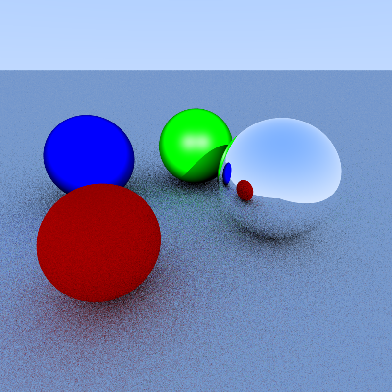

# Week 6 — Shadows, Reflections, Mirror and Diffuse Shaders, and Anti-Aliasing

This week expands your shading system into **recursive ray tracing** with **shadows**, **reflection**, and **anti-aliasing**.

---

## You are done if…

By the end of Week 6, you should be able to:

- Cast shadow rays to block light contributions
- Add a recursive ray tracer function with a depth limit
- Implement the recursive shaders (mirror and diffuse)
- Render with sub-pixel sampling for anti-aliasing
- Generate a scene with multiple lights and mixed materials
- Export the final image to PNG

---

## Files added / modified in Week 6

Ray tracing core:

```
RayTracer.h / .cpp   (The method computeRayColor is moved here)
Shader.h             (updated signature)
```

New materials:

```
MirrorShader.h / .cpp
DiffuseShader.h / .cpp
```

Shader updates:

```
LambertianShader.h / .cpp  (shadow rays)
BlinnPhongShader.h / .cpp  (shadow rays)
NormalShader.h / .cpp      (signature update)
```


Driver and build:

```
fbMain.cpp          (recursive tracing + AA + new scene)
CMakeLists.txt      (new .cpp files added)
```

---

## What your output should look like

When you run your Week 6 program, you should produce an image where:

- Objects cast clear shadows on each other
- Mirror surfaces reflect the environment
- Diffuse bounces appear softer than direct lighting
- Edges look smoother due to multi-sample anti-aliasing

If your image is still perfectly sharp with no softening, your AA may not be used.
If everything looks bright even where it should be blocked, your shadow rays are not working.

If you use the scene attached in `fbMain.cpp` below, you should have an image like this -



---

## Core idea of Week 6

### From direct shading to recursive light transport

Previously (Week 5):

- ray hit -> shader -> direct lighting

Now (Week 6):

- ray hit -> shader -> possibly spawn new rays -> accumulate color

---

### Shadow rays

For each light:

- cast a ray from the hit point to the light
- if any shape intersects first, skip that light

---

### Recursion depth

Recursive shaders can bounce rays indefinitely.
You must cap recursion with a depth counter to avoid infinite tracing.

---

### Anti-aliasing by stratified sampling

Each pixel is sampled multiple times in a grid.
Average the samples to reduce jagged edges.

---

## CMake reminder (very common issue)

If your build suddenly fails or features are missing, check:

- Did you add `RayTracer.cpp`, `MirrorShader.cpp`, `DiffuseShader.cpp`, and `Random.cpp` to your library target?
- Did you re-run CMake after updating `CMakeLists.txt`?

---

## How your code might look like

These are example snippets matching this week’s structure.
Your design can differ, as long as it meets the Week 6 checklist.

### Shader.h (updated function signature to properly accommodate all the shader functionalities)

**Steps:**
- Update the `rayColor` virtual method signature to accept references to ray, lights and shapes
- Add a `depth` parameter to control recursion depth
- This allows shaders to spawn recursive rays and access the scene for computations

<details>
<summary>Click to expand Shader.h</summary>

```cpp
//...

class Shader
{
public:
  virtual vec3 rayColor(const HitStruct &hit,
    const ray &r,
    const std::vector<std::shared_ptr<PointLight>> &lights,
    const std::vector<std::shared_ptr<Shape>> &shapes,
    int depth) = 0;
};
```

</details>

---

### RayTracer.h / RayTracer.cpp (Re-structured the computeRayColor method)

**Steps:**
- Move the `computeRayColor` method from your main file to a separate file so that both the reflective shaders and the main file have access to it

**RayTracer.h header:**

<details>
<summary>Click to expand RayTracer.h</summary>

```cpp
#pragma once

#include "ray.h"
#include "vec3.h"
#include <memory>
#include <vector>

class Shape;
class PointLight;

vec3 computeRayColor(const ray &r,
  const std::vector<std::shared_ptr<Shape>> &shapes,
  const std::vector<std::shared_ptr<PointLight>> &lights,
  int depth);
```

</details>

**RayTracer.cpp**

<details>
<summary>Click to expand RayTracer.cpp</summary>

```cpp
#include "RayTracer.h"

#include "HitStruct.h"
#include "NormalShader.h"
#include "PointLight.h"
#include "Shape.h"
#include "Shader.h"
#include <limits>

vec3 computeRayColor(const ray &r,
  const std::vector<std::shared_ptr<Shape>> &shapes,
  const std::vector<std::shared_ptr<PointLight>> &lights,
  int depth)
{
  if (depth <= 0) {
    return vec3(0.0, 0.0, 0.0);
  }

  float t_min = 0.001f;
  float t_max = std::numeric_limits<float>::max();

  HitStruct closestHit;
  closestHit.t = t_max;
  bool hitAnything = false;

  for (const auto &shape : shapes) {
    HitStruct tempHit;
    if (shape->intersect(r, t_min, t_max, tempHit)) {
      if (tempHit.t < closestHit.t) {
        closestHit = tempHit;
        hitAnything = true;
        t_max = tempHit.t;
      }
    }
  }

  if (hitAnything) {
    auto shader = closestHit.shape->getShader();
    if (shader) {
      return shader->rayColor(closestHit, r, lights, shapes, depth);
    }
    NormalShader defaultShader;
    return defaultShader.rayColor(closestHit, r, lights, shapes, depth);
  }

  vec3 unit_direction = unit_vector(r.direction());
  auto a = 0.5 * (unit_direction.y() + 1.0);
  return (1.0 - a) * vec3(1.0, 1.0, 1.0) + a * vec3(0.5, 0.7, 1.0);
}
```

</details>

---

### LambertianShader.cpp / BlinnPhongShader.cpp (shadow rays)

**Steps:**
- For each light in the scene, cast a shadow ray from the hit point toward the light
- Check if any shape blocks the ray before it reaches the light
- If blocked, mark the light as being in shadow and skip its contribution
- Only accumulate color from lights that are not blocked

<details>
<summary>Click to expand LambertianShader shadow ray code</summary>

```cpp
// ...

vec3 LambertianShader::rayColor(const HitStruct &hit,
  const ray &r,
  const std::vector<std::shared_ptr<PointLight>> &lights,
  const std::vector<std::shared_ptr<Shape>> &shapes,
  int depth)
{
  vec3 materialColor = hit.shape->getColor();
  vec3 color(0.0, 0.0, 0.0);

  for (const auto &light : lights) {
    vec3 lightPos = light->getPosition();
    vec3 lightDir = unit_vector(lightPos - hit.point);

    bool inShadow = false;
    ray shadowRay(hit.point, lightDir);
    float distanceToLight = (lightPos - hit.point).length();

    for (const auto &shape : shapes) {
      HitStruct shadowHit;
      if (shape->intersect(shadowRay, 0.001f, distanceToLight, shadowHit)) {
        inShadow = true;
        break;
      }
    }

    if (!inShadow) {
      // do the shading computation
    }
  }

  vec3 result = materialColor * color;
  return vec3(
    std::min(result.x(), 1.0),
    std::min(result.y(), 1.0),
    std::min(result.z(), 1.0));
}
```

</details>

---

### MirrorShader.cpp (recursive reflection)

**Steps:**
- Compute the reflected ray direction using the formula: $r = d - 2(d \cdot n)n$
- Offset the ray origin slightly along the surface normal to avoid self-intersection
- Recursively trace the reflected ray with decreased depth
- Return the color from the reflected path

<details>
<summary>Click to expand MirrorShader.cpp</summary>

```cpp
#include "MirrorShader.h"
#include "RayTracer.h"
#include "ray.h"
#include "vec3.h"

vec3 MirrorShader::rayColor(const HitStruct &hit,
  const ray &r,
  const std::vector<std::shared_ptr<PointLight>> &lights,
  const std::vector<std::shared_ptr<Shape>> &shapes,
  int depth)
{
  vec3 d = unit_vector(r.direction());
  vec3 n = unit_vector(hit.normal);
  vec3 reflected = d - 2.0 * dot(d, n) * n;

  const double epsilon = 0.001;
  ray reflectedRay(hit.point + n * epsilon, reflected);

  return computeRayColor(reflectedRay, shapes, lights, depth - 1);
}
```

</details>

---

### DiffuseShader.cpp

**Steps:**
- Generate a random direction in a unit sphere to simulate diffuse scattering
- Combine the random direction with the surface normal to bias scatter direction toward the normal
- Create a scattered ray from the hit point in the new direction
- Recursively trace the scattered ray and multiply the result by the material's diffuse reflectance color

<details>
<summary>Click to expand DiffuseShader.cpp</summary>

```cpp
#include "DiffuseShader.h"

#include "RayTracer.h"
#include "HitStruct.h"
#include "ray.h"
#include "vec3.h"
#include "Shape.h"
#include "Random.h"
#include <memory>

vec3 DiffuseShader::random_in_unit_sphere() const
{
  static sivelab::Random rand;
  vec3 randomDir;
  while (true) {
    randomDir = vec3(
      2.0 * rand.uniform() - 1.0,
      2.0 * rand.uniform() - 1.0,
      2.0 * rand.uniform() - 1.0
    );
    if (randomDir.length() < 1.0) break;
  }
  return unit_vector(randomDir);
}

vec3 DiffuseShader::rayColor(const HitStruct &hit,
  const ray &r,
  const std::vector<std::shared_ptr<PointLight>> &lights,
  const std::vector<std::shared_ptr<Shape>> &shapes,
  int depth)
{
  if (depth <= 0) {
    return vec3(0, 0, 0);
  }

  vec3 randomDir = random_in_unit_sphere();

  vec3 scatterDirection = hit.normal + randomDir;

  if (scatterDirection.length_squared() < 1e-8) {
    scatterDirection = hit.normal;
  }

  ray scatteredRay(hit.point, scatterDirection);

  vec3 scatteredColor = computeRayColor(scatteredRay, shapes, lights, depth - 1);

  return diffuseReflectanceColor * scatteredColor;
}

```

</details>

---

### Camera.h / PerspectiveCamera.cpp (If you only have generateRay methods with int arguments, you might need some way for it to accept float arguments for anti-aliasing)

**Steps:**
- Add an overloaded `generateRay` method that accepts floating-point pixel coordinates
- This allows sub-pixel sampling for anti-aliasing
- Use the float coordinates to compute ray direction with sub-pixel precision

**Camera.h header:**

<details>
<summary>Click to expand Camera.h</summary>

```cpp
class Camera
{
public:
  virtual ray generateRay(int i, int j) = 0;
  virtual ray generateRay(float i, float j) = 0; // float sampling
};
```

</details>

**PerspectiveCamera.cpp implementation:**

<details>
<summary>Click to expand PerspectiveCamera.cpp</summary>

```cpp
// ...
ray PerspectiveCamera::generateRay(float i, float j)
{
  float u = left + (right - left) * i / (float)nx;
  float v = bottom + (top - bottom) * j / (float)ny;
  vec3 rayDir = -focalLength * W + u * U + v * V;

  return ray(pos, rayDir);
}
```

</details>

---

### fbMain.cpp (anti-aliasing + recursion)

**Steps:**
- Set up the scene with multiple shapes, each with a different shader
- Create point lights at strategic positions
- For each pixel, perform stratified sampling: divide the pixel into a grid (e.g., 4x4)
- Add random jitter to each sample position within its grid cell for better distribution
- Trace a ray for each sub-pixel sample with a limited recursion depth
- Average all sub-pixel colors to get the final pixel color
- Export the final framebuffer to a PNG image

<details>
<summary>Click to expand fbMain.cpp</summary>

```cpp
// libraries and headers

float randomOffset()
{
  static std::uniform_real_distribution<float> distribution(0.0, 1.0);
  static std::mt19937 generator;
  return distribution(generator);
}

int main(int argc, char *argv[])
{
  int image_width = 800;
  int image_height = 800;

  Framebuffer fb(image_width, image_height);

  // Camera setup
  PerspectiveCamera cam(vec3(0, 3.0, 2.0), vec3(0, -1.5, -3.0), 0.4, 0.6, 0.6, image_width, image_height);

  // Create scene with spheres
  std::vector<std::shared_ptr<Shape>> shapes;

  // Create shaders
  auto lambertianShader = std::make_shared<LambertianShader>();
  auto blinnPhongShader = std::make_shared<BlinnPhongShader>();
  blinnPhongShader->setEyePosition(cam.getPosition());
  auto mirrorShader = std::make_shared<MirrorShader>();
  auto diffuseGroundShader = std::make_shared<DiffuseShader>(vec3(0.8, 0.8, 0.8));
  auto diffuse_redShader = std::make_shared<DiffuseShader>(vec3(1.0, 0.0, 0.0));


  // Create lights
  std::vector<std::shared_ptr<PointLight>> lights;
  lights.push_back(std::make_shared<PointLight>(vec3(3, 5, 2), vec3(1.0, 1.0, 1.0)));
  lights.push_back(std::make_shared<PointLight>(vec3(-3, 5, 2), vec3(1.0, 1.0, 1.0)));

  // Ground plane: Diffuse shader
  shapes.push_back(std::make_shared<Triangle>(
    vec3(0, 0, 5), vec3(200, 0, -200), vec3(-200, 0, -200), vec3(0.8, 0.8, 0.8), diffuseGroundShader));

  // Blue sphere: Lambertian shader
  shapes.push_back(std::make_shared<Sphere>(
    vec3(-2.5, 1.0, -4.0), 1.0f, vec3(0.0, 0.0, 1.0), lambertianShader));

  // Green sphere: Blinn-Phong shader
  shapes.push_back(std::make_shared<Sphere>(
    vec3(0, 1.0, -5.0), 1.0f, vec3(0.0, 1.0, 0.0), blinnPhongShader));

  // Red sphere: Diffuse shader
  shapes.push_back(std::make_shared<Sphere>(
    vec3(-1.3, 0.8, -1), 0.8f, vec3(1.0, 0.0, 0.0), diffuse_redShader));

  // Mirror sphere: Mirror shader
  shapes.push_back(std::make_shared<Sphere>(
    vec3(1.5, 1.10, -2.5), 1.10f, vec3(0.8, 0.8, 0.8), mirrorShader));

  // Anti-aliased rendering parameters
  int maxDepth = 4;
  int rpp_NSquare = 4;

  for (int x = 0; x < image_width; x++) {
    for (int y = 0; y < image_height; y++) {
      vec3 accumulatedColor(0.0, 0.0, 0.0);

      // Stratified sampling: divide pixel into rpp_NSquare x rpp_NSquare grid
      for (int p = 0; p < rpp_NSquare; p++) {
        for (int q = 0; q < rpp_NSquare; q++) {
          float pOffset = (p + randomOffset()) / rpp_NSquare;
          float qOffset = (q + randomOffset()) / rpp_NSquare;

          ray r = cam.generateRay(x + pOffset, y + qOffset);
          accumulatedColor += computeRayColor(r, shapes, lights, maxDepth);
        }
      }

      vec3 pixelColor = accumulatedColor / (float)(rpp_NSquare * rpp_NSquare);
      fb.setPixelColor(x, y, pixelColor);
    }
  }

  fb.exportToPNG("all_shaders.png");

  return 0;
}
```

</details>

---

## Self-check: Debug checklist

### “Shadows are missing”

Check:

- shadow ray origin offset (epsilon)
- shadow ray `t_max` set to distance to light
- you are skipping the light only when an object is hit

---

### “Everything is black”

Check:

- recursion depth is not zero
- ray directions are normalized
- shadow rays are not self-intersecting

---

### “Reflections look wrong”

Common issues:

- reflection vector formula is incorrect
- reflected ray starts exactly at hit point (self-hit)
- depth not decremented

---

## Important note about next steps

After Week 6, you are ready for:

- refraction / glass
- environment maps
- Monte Carlo path tracing

---

[Week5](week5.md) | [Home](index.md)
